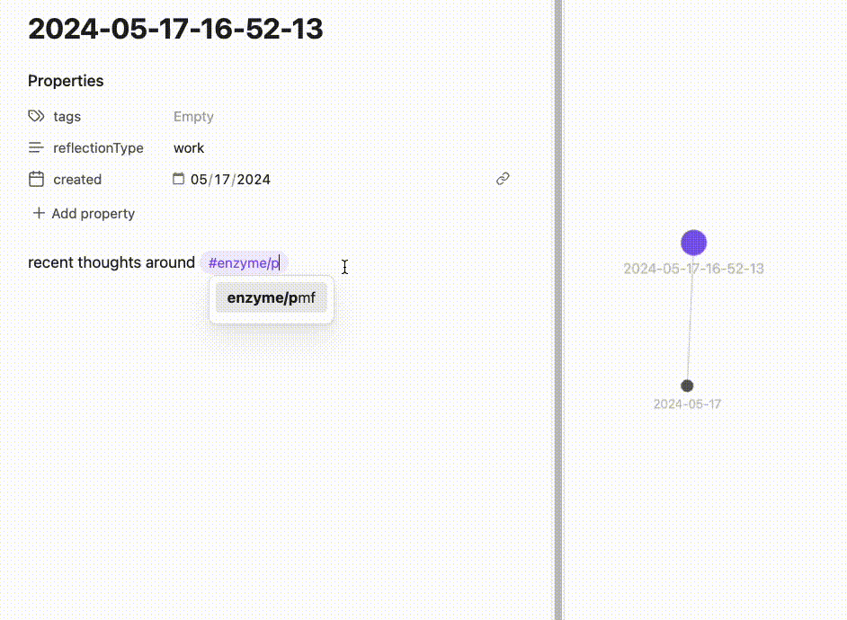

# Enzyme - digest your thoughts in Obsidian

**Version 0.2.3 contains an important change -- Reason has been renamed to Enzyme. Reason code blocks will still render for backwards compatibility. Once a PR has been merged to the Community Plugins repo, the plugin naming will become consistent. See the website for details about latest updates.**

Visit [enzyme.garden/getting-started](https://www.enzyme.garden/getting-started) for the best guide on how to use Enzyme.

You can also join the conversation on [Discord](https://discord.gg/UmShHCmh)!

Enzyme retrieves and helps synthesize your Obsidian notes right in the editor. It features:

- **Chat in markdown**: Chat UI that works entirely in Markdown / YAML (like a Jupyter Notebook for your notes)
- **Navigable output**: Renders relevant block embeds inline with the generated output, so you can navigate to the source
- **Flexible retrieval**: Powerful note retrieval powered by Dataview and extensible content extraction (a la YAML in a codeblock). Embedding-based retrieval is on the roadmap.
- **Workflow templates**: Re-curate your notes as they update, with workflow templates powered by Obsidian Canvas

If you enjoy this plugin, please consider supporting its development:

