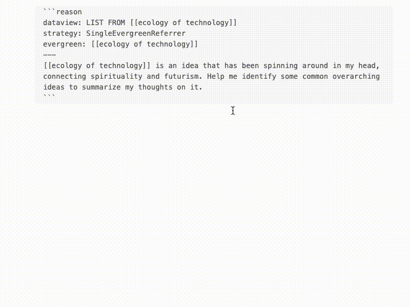
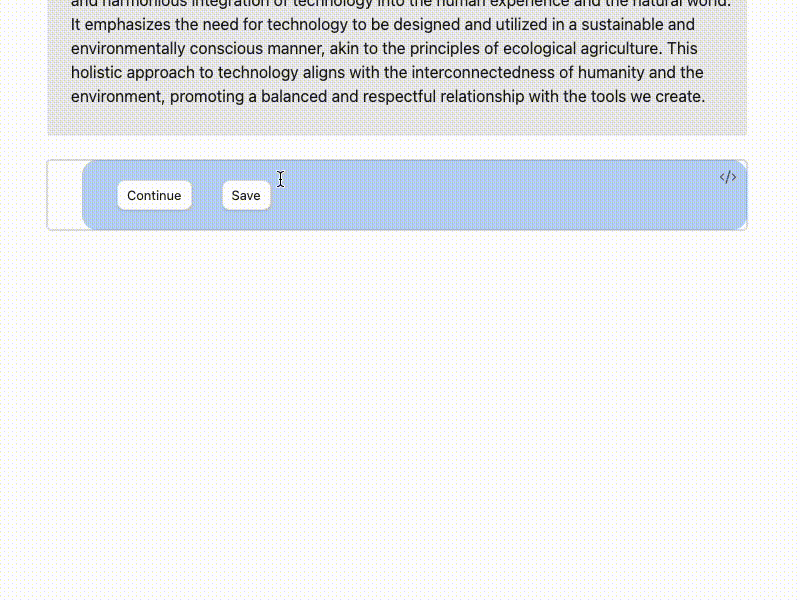

<style>
	code {
		white-space: pre-wrap !important
	}
</style>

## Setting up prerequisite plugins

Reason makes use of a few plugins:

- The excellent [Dataview](https://blacksmithgu.github.io/obsidian-dataview/) plugin in order to retrieve notes for synthesis. Dataview provides a live index with which to query the most up-to-date contents from your Obsidian notes. Make sure to install and enable this.
- It also works well when paired with the [Readwise](https://github.com/readwiseio/obsidian-readwise) plugin, which can import highlights from books, articles, and podcasts into Obsidian. More on the author's workflow with these two plugins [in a blog post](https://jphorism.substack.com/p/how-books-inspire-me-months-later).
- Ensure that the [Canvas](https://help.obsidian.md/Plugins/Canvas) plugin is enabled.

## Designed as a notebook

Reason is designed to be a notebook that you can chat with -- at their core, everything is plain text, meaning that you can remove chat messages of your own or ones that were AI-generated.

It borrows from the idea of REPL / Jupyter notebook cells, where each cell contains enough metadata to be self-sufficient and atomic.
## Setting up for synthesis

Let's say you have a note in your vault called `[[ecology of technology]]`.  You treat this as an "evergreen note", which is to say that you often make references to it in other notes. It's an idea that you often think about, and you want to make reference to it even if only in scattered ways.

Revisiting ideas like these becomes time consuming. Let's use Reason to make this easier. We'll query for notes that reference it and have the Reason agent synthesize the contents.

````
```reason
sources:
	- dql: |
		LIST FROM "Readwise/Books"
		WHERE contains(file.outlinks, [[ecology of technology]])
	  strategy: SingleEvergreenReferrer
	  evergreen: [[ecology of technology]]
guidance: [[ecology of technology]] is an idea that has been spinning around in my head, connecting spirituality and futurism. Help me identify some common overarching ideas to summarize my thoughts on it.
```
````

This code block is called an Aggregator, and we can place it anywhere, in any note. It uses YAML syntax. You'll notice that it has two parts: a `sources` section which has DQL (Dataview Query Language) and some metadata around it, and a guidance prompt.

A valid Aggregator will render the contents of the Dataview query like so:

<figure markdown>
{width="600"}
</figure>

### A little about Sources

Some info about the anatomy of a Source:

- The Dataview query retrieves notes from your vault
- The strategy determines how content is extracted from the note (to improve relevance when notes are very long, contain lots of irrelevant information, etc.)
- An evergreen is required for the `SingleEvergreenReferrer` strategy. It tells Reason to extract only contents just before and after mentions of the evergreen.

A Source can be even simpler:

````
```reason
sources:
	- dql: LIST FROM "Readwise/Articles"
guidance: Some reflections from my article highlights
```
````

This will extract using default behavior; that is, the entire contents of each note retrieved by Dataview. For more information about extraction strategies, see [Extraction Strategies](extraction-strategies.md).

We may also define several Sources for an Aggregator to use:

````
```reason
sources:
	- dql: |
		LIST FROM "Readwise/Books"
		WHERE contains(file.outlinks, [[ecology of technology]])
	  strategy: SingleEvergreenReferrer
	  evergreen: [[ecology of technology]]
	- dql: |
		LIST FROM "Readwise/Articles"
guidance: [[ecology of technology]] is an idea that has been spinning around in my head, connecting spirituality and futurism. Help me identify some common overarching ideas to summarize my thoughts on it.
```
````

## Synthesis

Great! Now that we have an Aggregator, we can create a Synthesis.

<figure markdown>
{width="600"}
</figure>


A finished Synthesis will automatically create a new Reason code block so you can continue the conversation. After seeing how well the agent understood the guidance, you might want to nudge the synthesis in a specific direction or give it some more context on the notes.

Hitting "Continue" on this produces an updated Aggregator that accounts for the new guidance. Then, we'll synthesize by hitting "Continue" on the next Reason code block with empty contents.

But remember, because everything is plain text, we can also delete the Synthesis block and start over by modifying the original Aggregator code block.
## Saving as a template

Let's say we're happy about how the conversation went: the Reason agent produced a useful and insightful synthesis of our notes on `[[ecology of technology]]`. What happens when we keep accumulating more references of `[[ecology of technology]]`? We'll need to keep updating the synthesis with our latest notes. Thankfully, we don't have to start the conversation from scratch each time. We can compile this into a template to reuse in the future.

Hitting "Save" tells the Reason agent to analyze the conversation and automatically craft (and name) Aggregators that best capture the conversation. It stores these as templates in a Canvas in the `reason` folder.

<figure markdown>
{width="600"}
</figure>


We can then load this template by using its Aggregator ID:

````
```reason
aggregator: ecology-technology-reflections
```
````
## What can I do with this?

You can use Reason templates in...

- Any template you're already using, like your Daily notes
- Evergreen notes, so you don't have to revisit all your latest notes on a topic in order to synthesize your ideas

You can interleave templates and even new Aggregators in any note, to help you supercharge your thought process in context. If your note gets too long, you can always collapse the Synthesis block.

If you don't have the Aggregator ID handy, you can also create a Reason code block with free text, and this will retrieve the most relevant Aggregator for you from among the templates in the Canvas.